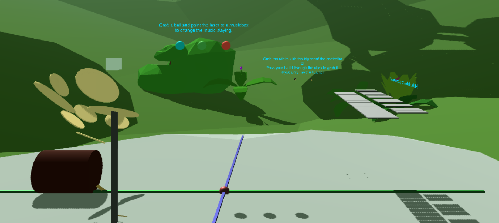
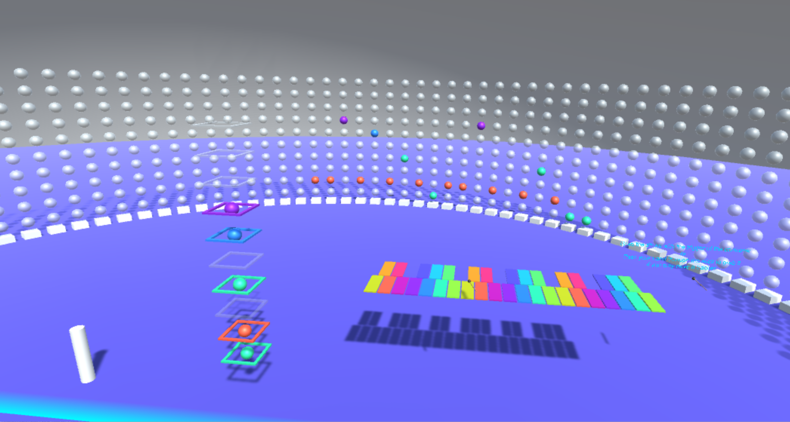

# VR-Music-Box
The project allows the users to play and create music in a multiplayer VR application.
The application disposes of two scenes.

## First basic scene
This scene is a singleplayer scene. You can't interact with others users.
You can play different instruments : Vibraphone / Drums / Cello and manipulate three predefined musics represented by three spheres. You can change the tempo and the frequency by associating a sphere to a HTC tracker and by moving this one in the environment.

## Second scene
This scene allows several users to play together. The application can run on two different technologies : a HTC Vive or a smartphone using Google VR Daydream.
The users can create music by playing instruments and then add and manipulate notes in a networked sequencer.

## Technologies
### Unity
This project has been realized using Unity.
### HTC Vive
The application has been designed using the HTC technology (HTC Vive and HTC trackers).
### Google VR Daydream
The application has been exported on the android devices. 

To use it, you need a device supporting Google Daydream. Click here to see all the devices https://vr.google.com/daydream/smartphonevr/phones/ .

You also need a Daydream View. If you don't have one, you can use a Google Cardboard to replace the headset. 

To substitute the controller, you can use a typical smartphone and install an emulator on it. Check the link below to configure the controller.
https://developers.google.com/vr/daydream/controller-emulator

### Photon Pun
To network the application, we used the Photon Pun framework. Check on this link for further information : https://www.photonengine.com/en/PUN

 
